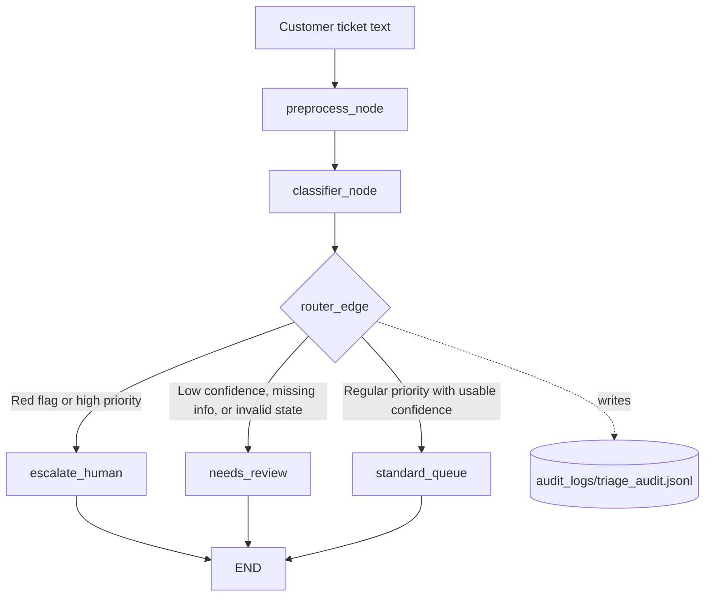

# Bank Ticket Triage Workflow 🏦

[](https://github.com/TehillaZ/bank-triage-langgraph/actions/workflows/ci.yml)

Bank Ticket Triage Workflow is a local AI-assisted support-ticket triage system for banking requests. It classifies customer messages with structured LLM output, applies deterministic safety rules, and routes each ticket to the right path: standard handling, manual review, or human escalation.


## Why This Project?

Banks receive support messages with very different risk levels. A branch-hours question can be handled normally, while a stolen-card report or suspicious-charge message needs fast escalation.

This project demonstrates a practical AI workflow pattern: the LLM proposes a structured classification, but deterministic routing code makes the final decision. That matters because high-risk support flows should not depend only on model judgment. Red-flag rules, confidence checks, and missing-information checks provide a safer layer around the classifier.

## Tech Stack


## Project Highlights

| Highlight | What It Shows |
| --- | --- |
| Structured LLM outputs | `models.py` defines a Pydantic schema for category, priority, sentiment, confidence, summary, reasoning, and missing information. |
| Deterministic safety rules | `router_edge()` checks red-flag patterns before trusting the model's priority. |
| Confidence-based routing | Low-confidence tickets are sent to `needs_review` instead of standard processing. |
| Human review path | High-risk tickets route to the LangGraph human escalation node. |
| Audit logging | Routing decisions are written to a local JSONL audit log for traceability. |
| Docker support | The repository includes a `Dockerfile` for containerized CLI/demo execution. |
| CI automation | GitHub Actions runs the test suite on push and pull request. |

## Key Features

- Classifies bank support text into structured categories with `langchain-groq`.
- Uses Pydantic `Literal` fields instead of free-text classifier labels.
- Applies red-flag regex rules for urgent fraud, stolen-card, and unauthorized-charge signals.
- Routes tickets to `standard`, `needs_review`, or `escalate`.
- Sends ambiguous, incomplete, low-confidence, or invalid states to manual review.
- Writes local JSONL audit entries with route, confidence, flags, reasoning, and errors.
- Provides both a single-ticket CLI and a built-in demo runner.
- Includes pytest coverage, GitHub Actions CI, and Docker execution.

## Architecture



## How It Works

`main.py` accepts one custom support ticket from command-line arguments or stdin. It preprocesses the input, asks the Groq-backed classifier for a structured response, and prints the final routing decision.

`app.py` runs three built-in demo examples: a high-risk fraud case, an ambiguous missing-information case, and a standard low-priority case.

## Run The Project

Install dependencies:

```bash
python -m pip install -r requirements.txt
```

### CLI Usage

Pass the ticket as a single command-line argument:

```bash
python main.py "My account is locked"
```

Or pipe input through stdin:

```bash
echo "Someone stole my card and I see a $500 charge" | python main.py
```

The CLI prints the classification result and routing decision.

### Demo Usage

Run the built-in evaluation/demo set:

```bash
python app.py
```

### Docker Usage

Docker is supported through the repository `Dockerfile`.

Build the Docker image:

```bash
docker build -t bank-triage-langgraph .
```

Run the CLI through Docker:

```bash
docker run --rm --env-file .env bank-triage-langgraph "My account is locked"
```

Run the demo script through Docker:

```bash
docker run --rm --env-file .env --entrypoint python bank-triage-langgraph app.py
```

## Example Outputs

### Standard Request

Input:

```text
What are your branch opening hours on Sundays?
```

Expected behavior:

```text
Classification: General support / regular priority
Routing decision: standard
```

### High-Risk Request

Input:

```text
Someone stole my wallet and I saw an unauthorized charge of $500.
```

Expected behavior:

```text
Classification: Fraud or card-related concern
Routing decision: escalate
Reason: deterministic red-flag rule detects urgent risk
```

### Ambiguous Request

Input:

```text
I have a problem with my account, can someone help?
```

Expected behavior:

```text
Classification: likely general support, but missing details
Routing decision: needs_review
```

## Sample Run

Example output from `python app.py`:

```text
=== Starting LangGraph Bank Triage Workflow ===

=== Running ticket: fraud_high_risk ===
[EVENT] Preprocess Node: Cleaning customer text...
[EVENT] Agent Classifier Node: Invoking LLM for analysis...
[REASONING] The customer explicitly states that their wallet was stolen and they have seen an unauthorized charge, which clearly indicates a fraud alert and requires immediate attention
[EVENT] Router Node: Checking priority...
[RED FLAG] Deterministic rule triggered escalation.
[HUMAN ACTION]: Escalated to Security Team.

=== Running ticket: ambiguous_missing_info ===
[EVENT] Preprocess Node: Cleaning customer text...
[EVENT] Agent Classifier Node: Invoking LLM for analysis...
[REASONING] The customer's request is vague, but it appears to be a general inquiry, so I chose the General_Support category with a Regular priority and Medium confidence level.
[EVENT] Router Node: Checking priority...
[ROUTE] Flagged for manual review: The customer needs help with their account

=== Running ticket: standard_low_priority ===
[EVENT] Preprocess Node: Cleaning customer text...
[EVENT] Agent Classifier Node: Invoking LLM for analysis...
[REASONING] The customer is asking a general question about branch hours, which is a common inquiry and does not indicate any urgency or distress, so I have chosen the General_Support category and Regular priority.
[EVENT] Router Node: Checking priority...
[ROUTE] Assigned standard ticket for department: General_Support.

=== Workflow Finished Successfully ===
```

## Tests

Run:

```bash
pytest
```

The tests cover preprocessing, standard routing, red-flag escalation, ambiguous input review, empty/invalid input handling, structured audit logging, and router safety when classifier fields are missing or invalid.

## Quality Gates

| Quality Gate | Tooling | Current Status |
| --- | --- | --- |
| Unit tests | `pytest` | Configured |
| Continuous integration | GitHub Actions | Configured |
| Container build | `Dockerfile` | Configured |
| Audit trail | Local JSONL logs | Configured |
| Linting | IDE diagnostics only | Partial |

## Known Limitations

- The classifier depends on the Groq API and requires the appropriate environment configuration.
- The CLI processes one ticket at a time.
- Audit logs are local JSONL files, not a database.
- The demo auto-approves human escalation for demonstration purposes.
- The route is printed/logged, but there is no full production queue integration.

## Future Improvements

- Add batch input support for CSV or folder-based ticket processing.
- Add an optional HTTP endpoint for local service usage.
- Add stricter linting and formatting with tools such as Ruff or Black.
- Add Docker-based test execution in CI.
- Add richer audit-log querying or export tools.
